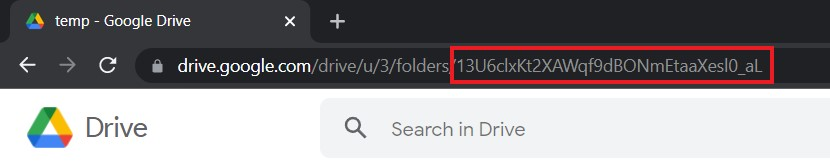

# gdrive-rclone-docker


## Introduction

This Docker image is used to mount to your Google Drive folder to a local folder. All files will appear as if they are locally on your system and you can browse like you normally would. Added files will at first be stored locally and pushed to Google Drive once per 6 hours. This will allow quick access to newly created files. Secondly there is a configurable cache pool to further improve the experience.

If you want to use the Google Drive space on your local network you can share the mounted folder as a SMB or NFS share.

## Tags
Base tag: ghcr.io/controlol/gdrive-rclone
- [**latest**](https://github.com/controlol/gdrive-rclone-docker) Build using the latest changes on this repo
- [**webui**](https://github.com/controlol/gdrive-rclone-docker/tree/webui) Uses latest tag and adds the webui

## Usage
This image will require some special flags to function properly, this is because you will be mounting mergefs (fuse) to a shared docker volume. Add the following flags to you docker cli `--cap-add SYS_ADMIN --device /dev/fuse`.

To Use Rclone with Google Drive you will need to allow access to your Google Drive API.

#### Prerequisites
You will need to have rclone installed on your machine or in a temporary docker container. Obtain a Google Drive API client id and secret following [this guide from Rclone](https://rclone.org/drive/#making-your-own-client-id). Somewhere in your drive you will need to create a root folder for you Rclone files to live. I would suggest calling it rclone. The RCLONE_FOLDER will live inside this folder. Open the folder in Google Drive and copy the folder id.



#### Create base rclone configuration

Once you have the client id, client secret and folder id you can run the command `rclone config`, this will prompt you with a couple of questions.
```
n - Creates a new remote
gdrive - Give your new remote a name, same as RCLONE_REMOTE
drive - Selects Google Drive
client_id - Enter the client ID you obtained previously
client_secret - Enter the client secret you obtained previously
1 - Enables access to the entire drive
root_folder_id - Enter your folder id from the created folder before
service_account_file - Leave blank and continue
y - Edit adavnce config
```

After this you want to keep clicking enter and use default options until you reach:
```
Remote config
Use auto config?
 * Say Y if not sure
 * Say N if you are working on a remote or headless machine
y) Yes (default)
n) No
```

Unless you are running the command on a PC with a browser you will want to choose `no`. It will give you a link you can paste in your browser. Take the steps and allow access to the folder. Once finished you will get a code and paste this in de Rsync terminal. Continue with the last two options.

```
n - Do not configure as team drive.
y - Accept the config.
```

Using the command rclone config file, you will get the location of the created config file. Copy this file to the folder where you plan to mount the config folder of the container and name the file `gdrive-rclone.conf`. This config will be used as a base configuration. The encrypted remote will be added automatically once you start the container.

### Docker CLI
```bash
docker run -d \
  --name=gdrive-rclone \
  --net=bridge \
  -e TZ=Europe/Amsterdam \
  -e PASSWORD=yourpassword \
  -e PASSWORD2=yourpassword \
  -e RCLONE_FOLDER=yourfolder \
  -e RCLONE_REMOTE=yourremote \
  -e LOCAL_CACHE_SIZE=250G \
  -e LOCAL_CACHE_TIME=12h \
  -e RCLONE_WEB_USER=gui \
  -e RCLONE_WEB_PASS=password \
  -v /path/to/localstorage:/local \
  -v /path/to/config:/config \
  -v /path/to/remote:/remote:rw,shared \
  --cap-add SYS_ADMIN --device /dev/fuse \
  --restart unless-stopped \
  ghcr.io/controlol/gdrive-rclone:webui
```

### Volumes

| Container path | Description | Type |
| ---  | --- | --- |
| /config | Contains the rclone configuration files | normal |
| /local  | Contains the local and cache files | normal |
| /remote | Use this folder to view and upload files | shared |

Make sure you have created the rclone base configuration and copied it to /config/gdrive-rclone.conf.<br/>
The /local directory has two folders, gdrive and cache. The cache folder has temporarily downloaded files from gdrive, and will not grow beyond LOCAL_CACHE_SIZE. The gdrive folder is temporary storage for files that still have to be uploaded to Google Drive.

#### File uploads
Every six hours files will be moved to Google Drive, a file is only considered if it is older than 6 hours
| File Age | Result |
| --- | --- |
| 0H < Created < 6H | Not uploaded |
| 6H < Created < 12H | Uploaded |
| 12H < Created | Upload limit reached or upload speed too slow<br> Upload will be retried during the next run |

### Environment
| Paramater | Function | Example |
| --- | --- | --- |
| RCLONE_FOLDER | The name of the remote subfolder you want to use | media |
| RCLONE_REMOTE | The name of your rclone drive remote | gdrive |
| PASSWORD | The password to encrypt your files | 64-128 char |
| PASSWORD2 | The password salt to encrypt your files | 64-128 char |
| LOCAL_CACHE_SIZE | The maximum size of cache | 250G |
| LOCAL_CACHE_TIME | How long cache should be kept | 12h |
| NO_CRYPT | Files are not encrypted if this variable is not empty | "yes" or "" |
| USE_COPY | Files are copied if this variable is not empty | "yes" or "" |
| RCLONE_WEB_USER | The username for the weblogin | gui |
| RCLONE_WEB_PASS | The password for the weblogin | password |
| TZ | The timezone of the container | Europe/Amsterdam |

### WebUI
This version of the image includes the [rclone-webui-react](https://github.com/rclone/rclone-webui-react), which is a beautiful API to interact with the rclone installation. Not only can you view and edit settings but it also shows stats like rclone uptime and data transferred. For more information and screenshots look at the repo on github.<br/>
This version of the image may allow you to disregard the [prerequisites step](#prerequisites) in the future.

The WebUI will be exposed to all interfaces of the container on port 80. You can use the bridge network to bind the port to a different port on the host by adding the argument `-p 5572:80`.

### Notes
It is recommended to use a random string for PASSWORD and PASSWORD2 between 64 and 128 characters, they should not be the same string.<br/>
Your LOCAL_CACHE_SIZE should be at least as the size as the largest file you expect to upload.<br/>
Setting USE_COPY will allow you to keep the files locally, they will still be uploaded on the same schedule.<br/>
A move job will not run for longer than 6h to prevent multiple jobs running at once.<br/>
The maximum upload limit is 750GB per day.
